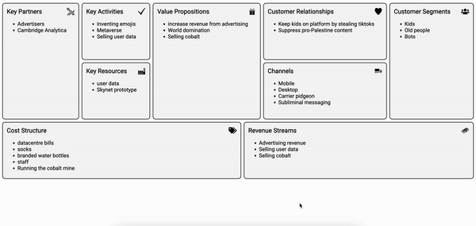

# Business Model Canvas

A [Business Model Canvas](https://en.wikipedia.org/wiki/Business_Model_Canvas) is a visual diagram whose purpose is to represent an entire business plan on a single page. They are especially popular with startups who need to rapidly reiterate their ideas.

I had to create one of these for a business module and I was stumped to find that there wasn't a single decent tool available for this purpose (powerpoint/excel sheets are not decent tools). So I made it myself.

## Tooling

This is a simple SPA using React and Vite as a build tool. Everything is written in pure beautiful Typescript.

Styling is all done in raw css. Sure, it might look better with a CSS framework, but that's not the point! It's plain but intentionally so. No-frills, black-and-white: perfect for printing! Or just inserting into a bland word document.
